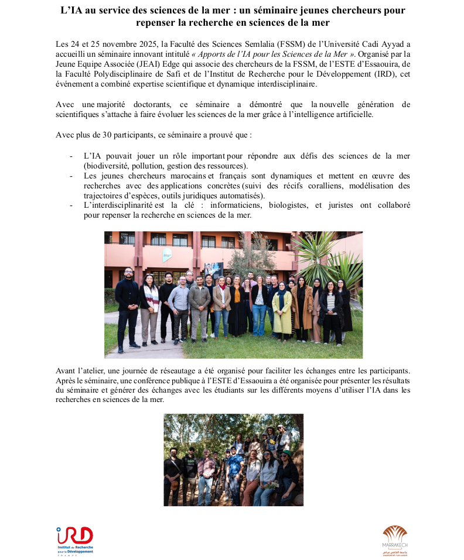
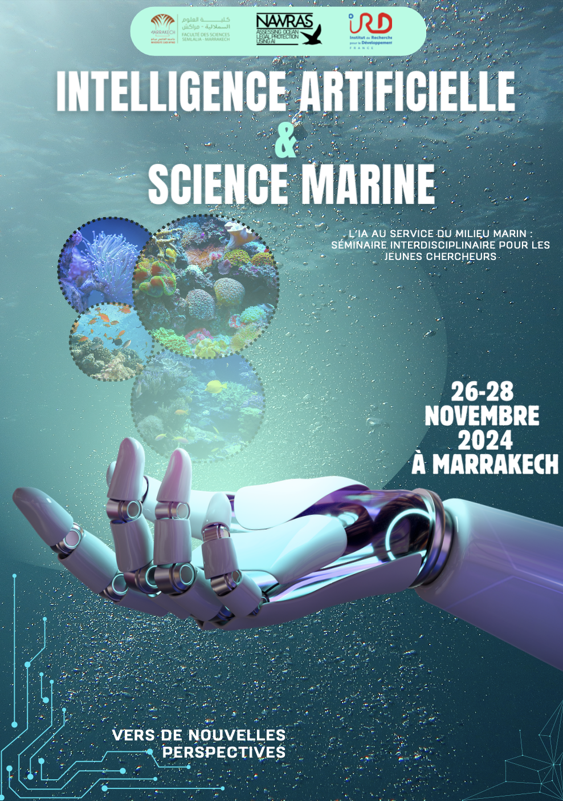
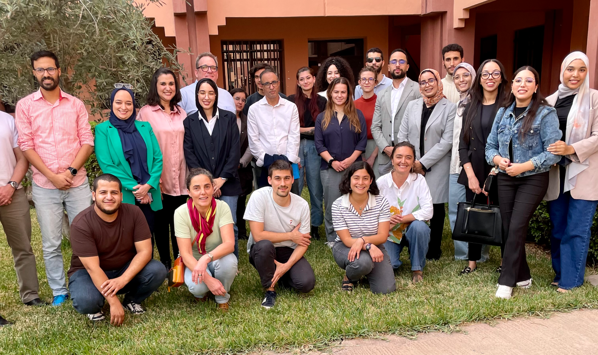
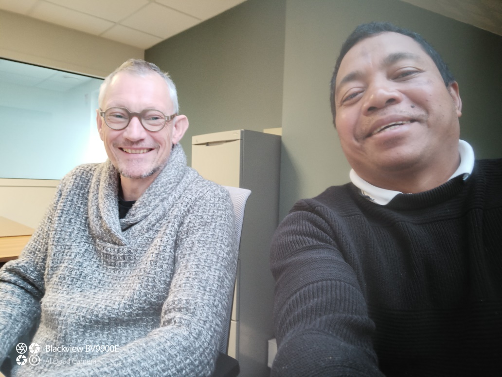

## Actions 2025

::: {.callout-note collapse="true"}
### École jeunes chercheurs

{.lightbox}
::: 

::: {.callout-note collapse="true"}
### Mobilités

* *Assane SAVADOGO* \

Mobilité sud-sud au Burkina-Fasso sur la modélisation et étude mathématique d’une infection épidémiologique dans une communauté écologique et au sein d’une population en commutation.

{width=100% height=400}

* *Radosoa ANDRIANAIVOARIVELO* \

Mobilité sud-sud à Madagascar pour l’organisation d’ateliers sur l’évolution des populations de chauves-souris frugivores de Madagascar sur les deux dernières décennies : menaces et opportunités » dans les universités d’Antananarivo, de Toliara, de Morondava et de Mahajanga.

{width=100% height=400}

* *Luis Fernandez NGOULA* \

Mobilité sud-nord du Cameroun à AMAP-Montpellier pour développer des modèles bayésiens de régressions non-linéaires adaptés à la démographie des arbres dans les forêts tropicales d’Afrique Centrale.

* *Fabrice NZOYEUEM DJONKO* \

Mobilité sud-nord afin de prolonger un accueil à Bruxelles au sein d’AMAP-Montpellier dans le cadre de la thèse sur l’influence des dynamiques fluviales sur la diversité et la structure des forêts d’Afrique centrale. 
::: 

## Actions 2024

::: {.callout-note collapse="true"}
### École jeunes chercheurs : l’IA pour le milieu marin

{width="10em"}

Ce séminaire s'inscrit dans le cadre du Projet Nawras qui vise à évaluer la protection juridique de l’environnement marin grâce à l’Intelligence Artificielle. Co-organisé par l’Université Cadi Ayyad et l’Institut de Recherche pour le Développement, il a rassemblé des chercheur$\cdot$euses en sciences de la mer, en droit et en intelligence artificielle travaillant sur des sujets transverses.

{width="15em"}

Le séminaire a permis de stimuler les collaborations entre jeunes chercheur$\cdot$euses. Les présentations ont mêlé thématiques globales, questionnements éthiques et applications précises. Les sujets de thèse ont été présentés sous forme de posters, et au cours d'une conférence grand public à l’Université Cadi Ayyad pour présenter la variété d’enjeux de protection des océans et les perspectives émergentes.
:::

::: {.callout-note collapse="true"}
### Mobilités

* *Wendpanga BIRBA* \
La dengue, une infection virale transmise par les moustiques, représente un défi de santé publique majeur dans les régions tropicales et subtropicales. Le virus présente quatre sérotypes dont la co-circulation dans une même population humaine augmente le risque de réinfection, chaque réinfection par un sérotype différent étant associée à un risque accru de complications graves.
Ma mission s’intégrait dans un projet qui vise à développer un modèle intégrant les quatre sérotypes pour fournir une représentation précise de la dynamique épidémique. En incorporant des mécanismes d'autorégulation de l'environnement, ce modèle permet d'analyser l'impact de la densité vectorielle sur la  propagation de la maladie. Ce travail pourrait fournir un support précieux pour les décideurs en santé publique dans la lutte contre la dengue.

* *Rickarlos BEZANDRY* \ 
La dynamique actuelle du changement global menace la production et la pérennité de nombreuses denrées mondiales. Parmi ces produits, le café occupe une place centrale à la fois pour les moyens de subsistance de millions de petits exploitants, et en tant que ressource particulièrement menacée par le changement climatique. Certaines espèces sauvages rares de café poussant dans des paysages très arides à Madagascar représentent une ressource génétique cruciale pour développer de nouvelles variétés de café résistantes et faire face aux défis environnementaux actuels. Notre projet montre qu’une approche botanique des espèces de café sauvages peut fournir les connaissances nécessaires pour orienter les stratégies d’amélioration variétale et créer des variétés de café résilientes face au climat. Avec le soutien de l'INR LiStat, nous avons mis en place des minis ateliers pour démontrer statistiquement l'intérêt de cette approche. \

The current global change dynamic is threatening the production and maintenance of many global commodities. Among these products, Coffee is at the same time central for the livelihoods of millions of smallholder farmers, and one of the most threatened resources by climate change. Some rare wild coffee species growing in very dry landscapes in Madagascar, offer a crucial genetic resource to breed new resistant coffee varieties and overcome ongoing environmental challenges. Here, we show that a botanical approach of wild coffee species can provide the required knowledge to guide breeding strategies and climate-create resilient coffee varieties. With the support of INR LiStat, we set up mini-workshops to statistically demonstrate the value of this approach.

* *Radosoa ANDRIANAIVOARIVELO* \
Ma mission dans le cadre de l’étude de l’écologie des chauves-souris frugivores et de l’analyse statistique des données obtenues à Madagascar (Rufford Small Grants) a permis d’avoir des résultats pertinents sur la caractérisation des sites d’alimentation et des plantes utilisées par les chauves-souris. Cette mission financée par LISTAT était accueillie au sein de l’UMR DECOD (Dynamique et durabilité des écosystèmes : de la source à l’océan) par Éric Petit, chercheur à INRAE. Cette mission a permis de renforcer la collaboration entre des départements de recherche en France et à Madagascar et d’amorcer la publication des résultats. 

{width="15em"}

:::
